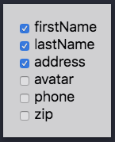

# React Tiny Feature Switch

🚗 A feature-packed, tiny (~900B) React Feature Toggle

> This project uses React Hooks, so you need at least React version 16.8

## Features
- It's small, so it won't take up your size budget
- Define features using a JS object or external JSON file
- Toggle features using URL Query Parameters, e.g., http://domain.com?someFeature=true
- Comes with a dev mode Toggler that allows for easily toggling of features (toggle via URL Query)
- Conditionally render components if a feature is not enabled
- Written in TypeScript so you get good autocompletion

## Installation
`npm i react-tiny-feature-switch` or `yarn add react-tiny-feature-switch`

## Example
The left side of the example is the rendered code. The right side is the actual code used to render
the left side.
[https://dericgw.github.io/react-tiny-feature-switch](https://dericgw.github.io/react-tiny-feature-switch)

## Usage
Here is the basic gist of how to use it...
```json5
// features.json

// The shape of the features object must be like so... [string]: boolean
{
  "avatar": false,
  "profile": true
}
```

```js
// index.js
import { Features } from 'react-tiny-feature-switch'
import features from './features.json'; // Could be a JS file

const App = () => (
  <Features features={features}>
    <OtherAppStufff />
  </Features>
);

// profile.js
import { FeatureSwitch, Else } from 'react-tiny-feature-switch';

const Profile = () => (
  <div>
    // See if the "avatar" feature is available
    <FeatureSwitch feature="avatar">  
      
      // If the "avatar" is not available, then render something Else
      <Else>
        
      </Else>
    </FeatureSwitch>
  </div>
);
```

## Components
### `<Features />`
This is the Provider component that uses React Context in order to pass the props down to the other
components. It only has one prop, `features`, which takes an object of features whose key is the 
feature name and value is a boolean. This component should be close to the root component so that
all of the child components have access to the provided props.

#### Props
| Name       | Type                         | Default Value | Required | Description                                                                                                                                           |
|------------|------------------------------|---------------|----------|-------------------------------------------------------------------------------------------------------------------------------------------------------|
| `features` | `Object { [string]: boolean }` | `{}`          | true     | This is an object of features that the app will have and it should be in the form of `{ featureName: true }` (or, `false` if the feature is disabled) |

### `<FeatureSwitch />` 
This component will wrap the features that are being worked on and either show them or hide them if 
the feature is enabled, or disabled. The `<FeatureSwitch />` component accepts two props, a `feature`
prop and `children` props. The `feature` prop is a `string` or `string[]` (array of strings). If the 
string that is passed in is `true` in the `features` object, which is passed into the `<Features />` 
component, the child components will be displayed. 

If an array of strings are passed in, they will both need to features that resolve to `true` in order 
for the feature to be enabled. This could be useful for versioning the app. For instance, if your 
are working on `v1.1`, then all of the features that are related to `v1.1` could be set to `true` in 
the `features` object. Also in that `features` object, there could be a `v1.1` feature that is set to
`true` as well. Now, you do something like this: `<FeatureSwitch feature={['profile', 'v1.1']} />`. 
If you want to hide all of the `v1.1` features (maybe you need to do a hotfix), you can set the 
`v1.1: false` in the `features` object, and none of the `v1.1` features will be displayed.

The `children` prop is any React type node.

#### Props
| Name       | Type              | Default Value | Required | Description                                                                                                                                                   |
|------------|-------------------|---------------|----------|---------------------------------------------------------------------------------------------------------------------------------------------------------------|
| `feature`  | `string`          |               | true     | This is the feature that will be either "on" or "off", depending on whether it is `true` or `false` in the `features` object of the `<Features />` component. |
| `children` | `React.ReactNode` |               | true     | This is the component or components that will be rendered if the `feature` is enabled.                                                                        |

### `<Else />` 
Sometimes it will be necessary to render parts of the UI when a feature is disabled - this is the job
of the `<Else />` component. The `<Else />` component should be a child to the `<FeatureSwitch />`
component. Check it out...

```js
<FeatureSwitch feature="avatar">  
  
  // If the "avatar" is not available, then render something Else
  <Else>
    
  </Else>
</FeatureSwitch>
```

> NOTE: The `<Else />` component will not work if it is not a child of the `<FeatureSwitch />` 
> component

#### Props
| Name       | Type              | Default Value | Required | Description                                                                                                                 |
|------------|-------------------|---------------|----------|-----------------------------------------------------------------------------------------------------------------------------|
| `children` | `React.ReactNode` |               | true     | This is the component or components that will be rendered if the parent `feature`, in the `<FeatureSwitch />`, is disabled. |

### `<FeatureToggler />`
The `<FeatureToggler />` is a helper component that easily allows a dev or QA engineer to toggle
features on and off. Just add the `<FeatureToggler />` component to the app and you will notice a
div (bottom, right corner) with a checkbox for each feature is rendered in the app. The value of the 
checkbox will reflect the `features` object of the `<Features />` component. Here is what it looks 
like:



> NOTE: It is a good idea to conditionally render the `<FeatureToggler />` component so that your 
> production build does not include it.

The `<FeatureToggler />` accepts one props - `alwaysShow`, which is a boolean. If this is set to 
`true`, the `<FeatureToggler />` will always be displayed. If this prop is not present, or set to
`false`, then the `<FeatureToggler />` will only be shown if a URL Query param of `featureToggler` is
present in the URL, e.g., `http://localhost?featureToggler=true` 

## URL Query Params
You can pass query params in the URL to override a feature's state (enabled or disabled). If you 
want to enable a feature, you can pass `true` or `1`. Anything else will evaluate to `false`. For 
instance:

`http://localhost?firstName=true&lastName=1&profile=false&address=foobar`

In the case above, here is the final evaluation:
- `firstName: true`
- `lastName: true`
- `profiletName: false`
- `address: false`

> NOTE: The URL Query param values will override what is passed in to the `features` object.

## Contributing
More on this very soon...

## Issues
Open up an issue if you find one. If you can provide a reproduction, then please do. You can use
[codesandbox.io](https://codesandbox.io) for this.

## License (MIT)
[Check it out here.](./LICENSE.md)
